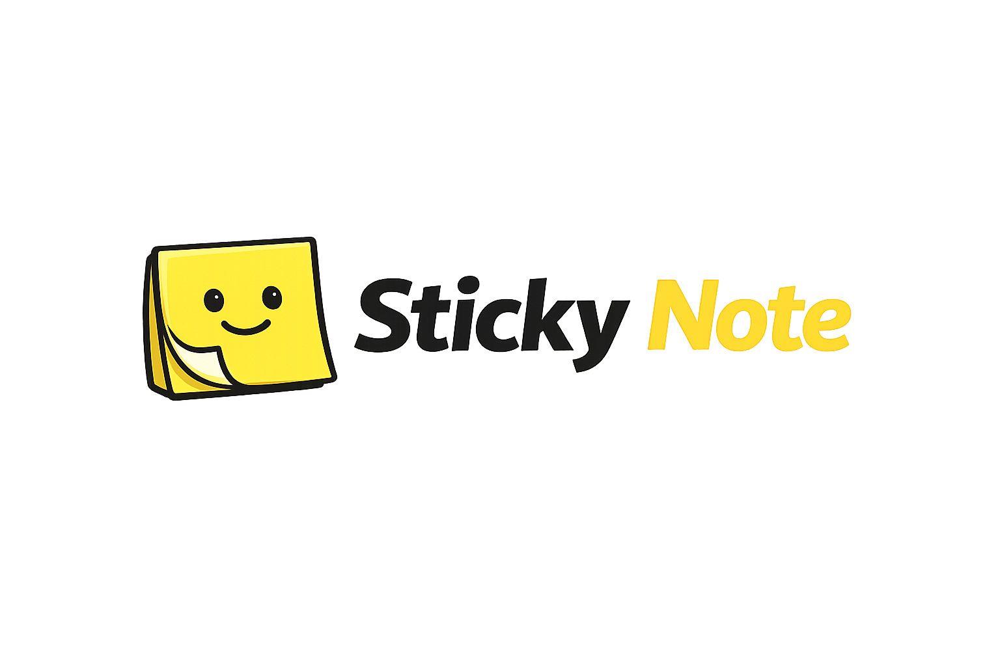

<p align="center">
  <!-- Replace with your own logo -->
  
</p>
<p align="center">
  <strong>Human-to-human handoff for AI coding assistants.</strong><br/>
  Git-backed shared memory that captures session threads and surfaces<br/>
  teammate context — automatically, inside the tools you already use.
</p>

<p align="center">
  <a href="https://www.npmjs.com/package/sticky-note"></a>
  <a href="LICENSE"></a>
  <a href="https://nodejs.org">= 16" /></a>
  <a href="#supported-tools"></a>
</p>

<br/>

<p align="center">
  
</p>

<br/>

> [!NOTE]
> **Sticky Note is evolving.** Features, APIs, and file formats may change as we learn what works best for teams.

---

## The Problem

I have seen many agent-to-agent to orchestration systems and frameworks, but I still like working with other people.
Other people that ALSO use agents to develop. I couldn't get my agent to understand what my friends agents were doing.
So we built Sticky Note.

## The Solution

Sticky Note captures what happened in each AI session (files touched, status,
narrative, failed approaches) and surfaces it to teammates automatically on
their next session by relevance.

---

## What's New in V2.5

- **Smart injection (two-tier)**: Stuck threads injected eagerly at session start; all other threads injected lazily when you first touch a file they authored — via built-in git blame attribution
- **Thread resume (local)**: `npx sticky-note resume-thread --query "auth fix" --user alice` — natural language thread discovery with text similarity + file attribution ranking
- **Built-in attribution engine**: `npx sticky-note get-line-attribution --file src/auth.ts` — maps file lines to commit SHAs via git blame, resolves to threads with line ranges. No external dependencies.
- **Git Notes storage**: Session attribution stored in `refs/notes/sticky-note` — survives rebase/amend
- **Three-tier SHA resolution**: Git Notes → Audit JSONL → File+date heuristic — attribution never breaks
- **PreToolUse hook**: New hook fires before each tool call for lazy injection with line-range detail
- **Thread schema additions**: `contributors[]`, `resumed_by`, `resumed_at`, `resume_history[]` — multi-contributor threads with full resume chain

### What's New in V2

- **Per-user audit & presence**: Audit logs and presence in per-user files under `audit/` and `presence/` — committed and shared with the team
- **Relevance scoring**: Context injected based on file overlap, branch match, and recency
- **Richer threads**: Narrative summaries, failed approaches, work type, activities
- **Tombstone expiry**: Old threads are automatically cleaned up via `gc`
- **Presence tracking**: See who's currently active with `npx sticky-note who`
- **Codex support**: Wrapper script for post-session capture
- **Separate config**: Team settings in `sticky-note-config.json`

---

## Quick Start

### 1. Install

```bash
npx sticky-note init
```

This runs an interactive setup that:
- [OK] Checks for git and Node.js 16+
- 📋 Asks for team config (MCP servers, conventions, stale days)
- 📁 Creates all hook scripts and config files

### 2. Commit

```bash
git add .claude .github .sticky-note .gitignore .gitattributes CLAUDE.md
git commit -m "feat: add sticky-note hooks"
```

### 3. Push & Pull

```bash
git push        # Share with team
git pull        # Teammates — no additional setup needed
```

### 4. Work

Open Claude Code or Copilot CLI and start working. Sticky Note runs
in the background via hooks — capturing threads and surfacing context.

**First thing to try** — ask your AI agent:

> "Show me the active sticky note threads"

---

## How Context Gets Injected

Sticky Note injects context through **four mechanisms**: two that run
automatically via hooks, one triggered manually via the CLI, and one
that's always available as a static file.

### 1. Static Instruction Files (always available)

`npx sticky-note init` deploys AI instruction files that teach each tool
how to interact with Sticky Note:

| File | Consumed by | Installed to |
|------|-------------|--------------|
| `CLAUDE.md` | Claude Code | repo root |
| `copilot-instructions.md` | Copilot CLI | `.github/` |

These files contain thread field references, status icons, resume
instructions, display formats, and query examples. They're wrapped in
`<!-- sticky-note:start/end -->` markers so `npx sticky-note update` can
refresh them without overwriting your own content.

### 2. Session Start Hook (`session-start.js`)

Runs once when a session begins. V2.5 uses **eager injection** for stuck
threads only — non-stuck threads are held for lazy injection.

- **Resumed thread** — If a `.sticky-resume` signal file exists, the full
  thread payload is injected: narrative, files touched, failed approaches,
  conversation prompts, and the complete resume chain history.
- **Stuck threads** — All stuck threads are injected eagerly (V2.5).
- **Team config** — Conventions, MCP servers, and skills from
  `sticky-note-config.json`.
- **Active presence** — Developers seen in the last 15 minutes and the
  files they're working on.

The hook also clears the injected-this-session tracking set, snapshots
`HEAD`, generates a session ID, and ages stale threads.

### 3. Per-Prompt Injection (`inject-context.js`)

Runs on **every user prompt**. Scores all live threads by relevance and
injects the top 3–5 (under token budget) as additional context.
**V2.5:** Skips threads already injected by session-start or PreToolUse.

| Signal | Weight | Description |
|--------|--------|-------------|
| File overlap | 3 | Thread files match your recent git changes |
| Branch match | 2 | Thread is on your current branch |
| Recency | 2 | Decays 0.2 per day from last activity |
| Stuck status | +2 | Boost for threads marked stuck |
| Prompt keywords | 1 | File names mentioned in your prompt |
| Same developer | 1 | Your own previous threads |
| Resume signal | +10 | Thread targeted by `.sticky-resume` |

### 3b. PreToolUse Hook (`pre-tool-use.js`) — V2.5

Runs **before each tool call**. Lazy injection tier:

1. Extracts target file from tool input
2. Runs `git blame --line-porcelain <file>` → commit SHAs per line
3. Three-tier SHA resolution: Git Notes → Audit JSONL → File+date heuristic
4. Resolves session IDs → loads threads with line ranges
5. Injects matching threads (if not already injected this session)

No external dependencies — uses built-in git blame.

### 4. Resume Flow (`npx sticky-note resume <id>`)

A manual trigger that enables **cross-tool handoff** (e.g., Claude Code →
Copilot CLI):

```
npx sticky-note resume <thread-id>
```

1. Writes the thread UUID to a `.sticky-resume` signal file.
2. Outputs the thread's full context to the terminal (narrative, files,
   failed approaches, conversation prompts).
3. On the next session start, `session-start.js` detects the signal,
   reopens the thread as `open`, and injects the complete payload.
4. `inject-context.js` gives the resumed thread a +10 score boost on
   every prompt for the duration of the session.
5. `session-end.js` clears the signal file and updates the thread's
   `resume_chain` with the new session.

This means a thread started in Claude Code can be resumed in Copilot CLI
(or vice versa) with full context preserved — including the original
conversation prompts.

---

## How Context Gets Collected

The injection hooks above are fed by four **collection hooks** that run
silently in the background:

### Tool Tracking (`track-work.js`)

Runs after every tool use. Appends a JSONL audit entry with the tool
name, file path, and session ID. Also updates the user's presence file
(`presence/<username>.json`) so `session-start.js` can show who's active.

### Session End (`session-end.js`)

Runs when a session ends. Captures the full thread record:

- **Files touched** — from audit trail, transcript parsing, and git diff
  against the HEAD snapshot from session start.
- **Narrative** — last assistant message (300 char max).
- **Work type** — inferred from activity patterns (bug-fix, feature,
  debugging, testing, documentation, etc.).
- **Failed approaches** — extracted where error + retry patterns both match.
- **Prompts** — stored for cross-tool resume (up to 20, 300 chars each).
- **Tool calls** — counts per tool (Edit, Read, Write, etc.).

Also runs a lazy tombstone sweep: closed threads older than `stale_days`
are expired to minimal footprint.

### Error Capture (`on-error.js`)

Runs when a tool execution fails. Creates or updates the session thread
with status `stuck` and appends the error to `failed_approaches`. Next
session's `inject-context.js` ranks stuck threads higher so teammates
see them.

### Stop Handler (`on-stop.js`, Claude Code only)

Runs when the user stops a session. Builds a structured handoff summary
(what was done, what failed, current status, next steps) and saves it to
the thread's `handoff_summary` field.

---

## What Gets Captured

| Data              | Captured | Example                              |
|-------------------|----------|--------------------------------------|
| Files touched     | [OK]        | `src/auth.ts`, `lib/db.py`          |
| Thread status     | [OK]        | open, stuck, stale, closed, expired  |
| Author            | [OK]        | OS username                          |
| Timestamp         | [OK]        | ISO 8601                             |
| Narrative         | [OK]        | "Fixed auth token refresh flow"      |
| Failed approaches | [OK]        | What was tried, errors, files        |
| Work type         | [OK]        | bug-fix, feature, debugging, etc.    |
| Code content      | [ERR]        | Never captured                       |
| Conversation      | [ERR]        | Never captured                       |
| Credentials       | [ERR]        | Never captured                       |

---

## Thread Lifecycle

```
open → stale  (auto, after stale_days with no activity)
open → closed (on session end)
stuck → closed (on session end or manual)
closed → open  (via `npx sticky-note resume <id>`)
closed → expired (auto, tombstoned by gc after stale_days)
```

Expired threads keep only their ID, status, user, and closed timestamp.

---

## File Structure

```
CLAUDE.md                         # AI instructions for Claude Code

.claude/
├── settings.json             # Claude Code hook config
└── hooks/
    ├── sticky-utils.js       # Shared utilities
    ├── session-start.js      # Load & inject teammate context
    ├── session-end.js        # Capture session thread
    ├── inject-context.js     # Per-prompt relevance scoring
    ├── pre-tool-use.js       # Lazy injection via git blame attribution (V2.5)
    ├── sticky-attribution.js # Built-in attribution engine (V2.5)
    ├── sticky-git-notes.js   # Git Notes utilities (V2.5)
    ├── track-work.js         # JSONL audit + presence + line tracking (V2.5)
    ├── parse-transcript.js   # Narrative + failed approach extraction
    ├── on-stop.js            # Handoff summary on stop
    ├── on-error.js           # Stuck thread on error
    ├── post-rewrite.js       # Git Notes rewrite survival (V2.5)
    └── sticky-codex.sh       # Optional Codex wrapper

.github/
├── copilot-instructions.md   # AI instructions for Copilot CLI
└── hooks/
    └── hooks.json            # Copilot CLI hook config

.sticky-note/
├── sticky-note.json          # Shared threads (git-tracked)
├── sticky-note-config.json   # Team config (git-tracked)
├── audit/                    # Per-user audit logs (git-tracked)
│   └── <username>.jsonl      # One file per team member
├── presence/                 # Per-user presence (git-tracked)
│   └── <username>.json       # One file per team member
├── .sticky-resume            # Resume signal (local only)
├── .sticky-injected          # Injection tracking (local only, V2.5)
└── .sticky-active-resume     # Active resume marker (local only, V2.5)
```

---

## CLI Commands

```bash
npx sticky-note init           # Interactive setup
npx sticky-note init --codex   # Setup with Codex wrapper
npx sticky-note update         # Update hook scripts (preserves data)
npx sticky-note status         # Diagnostic report (includes attribution health)
npx sticky-note threads        # List threads with status icons
npx sticky-note resume         # List resumable threads
npx sticky-note resume <id>    # Resume a previous thread
npx sticky-note resume --clear # Cancel active resume
npx sticky-note resume-thread  # Smart resume: --query, --user, --file (V2.5)
npx sticky-note audit          # Query merged audit trail (all users)
npx sticky-note who            # Show active and recent team members
npx sticky-note switch <branch> # Safe branch switch (auto-stashes data)
npx sticky-note gc             # Tombstone expired threads
npx sticky-note reset          # Wipe all threads (--force, --keep-audit)
npx sticky-note get-line-attribution # File→thread attribution with line ranges (V2.5)
npx sticky-note checkpoint         # Set work-topic checkpoint for attribution (V2.5)
npx sticky-note --version      # Show version
npx sticky-note --help         # Show help
```

### Audit Filters

```bash
npx sticky-note audit --user alice
npx sticky-note audit --file src/auth.ts
npx sticky-note audit --since 2025-01-01
npx sticky-note audit --session abc-123
npx sticky-note audit --limit 100
```

---

## Configuration

Edit `.sticky-note/sticky-note-config.json`:

```json
{
  "stale_days": 14,
  "mcp_servers": [],
  "skills": [],
  "conventions": ["Use TypeScript strict mode", "Test before commit"],
  "hook_version": "2.5.0"
}
```

| Key            | Description                              | Default |
|----------------|------------------------------------------|---------|
| `stale_days`   | Days before threads expire + gc cleanup  | `14`    |
| `mcp_servers`  | Shared MCP server references             | `[]`    |
| `skills`       | Team skill definitions                   | `[]`    |
| `conventions`  | Team coding conventions (injected)       | `[]`    |

---

## Requirements

- **Git** repository (any host)
- **Node.js 16+** (for hook scripts and `npx` CLI)
- **Claude Code**, **Copilot CLI**, and/or **Codex**

---

## Supported Tools

| Tool        | Hook Config                 | Integration                     |
|-------------|-----------------------------|---------------------------------|
| Claude Code | `.claude/settings.json`     | Full — all 6 hooks + transcript |
| Copilot CLI | `.github/hooks/hooks.json`  | Full — all hooks                |
| Codex       | `sticky-codex.sh` wrapper   | Post-session capture            |

All tools call the same JavaScript hooks and share the same data files.

---

## Concurrent Usage & Merge Strategy

`npx sticky-note init` adds a `.gitattributes` rule:

```
.sticky-note/sticky-note.json merge=union
```

This tells git to **keep lines from both sides** instead of conflicting.
Threads have unique UUIDs, so concurrent pushes merge cleanly.

Per-user audit logs (`audit/<username>.jsonl`) and presence files
(`presence/<username>.json`) are written by one user at a time, so they
never conflict.

### Branch Switching

Sticky-note data (audit logs, presence, thread state) is **branch-independent** —
it's metadata about the repo, not part of the source code. However, because
these files are git-tracked and updated on every tool call, a raw
`git checkout` or `git switch` will fail if there are uncommitted changes.

Use one of these approaches:

```bash
# Recommended: sticky-note CLI wrapper
npx sticky-note switch <branch>

# Or: git alias (set up by npx sticky-note init)
git sw <branch>
```

Both auto-stash `.sticky-note/` before switching and restore it after.
See [docs/branch-switching.md](docs/branch-switching.md) for the full
design discussion.

---

## FAQ

**Q: Does this capture my code or conversations?**
A: No. Only file paths, timestamps, usernames, and status metadata.

**Q: What happens with merge conflicts in sticky-note.json?**
A: `merge=union` in `.gitattributes` handles most cases automatically.

**Q: Can I close a thread manually?**
A: Edit `sticky-note.json` and change the thread's `status` to `"closed"`,
or run `npx sticky-note gc` to tombstone expired threads.

**Q: Does this work offline?**
A: Yes. Everything is local until you `git push`.

**Q: How do I set up Codex?**
A: Run `npx sticky-note init --codex`, then alias the wrapper:
`alias sticky-codex=".claude/hooks/sticky-codex.sh"`

---

## License

[MIT](LICENSE) — fully open source, no restrictions.

---

## Contributing

See [CONTRIBUTING.md](CONTRIBUTING.md) for guidelines.
